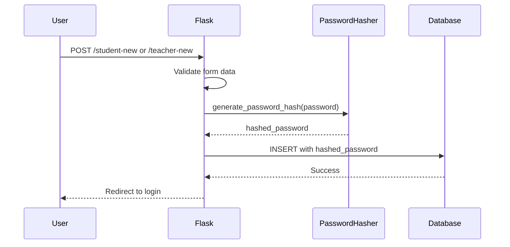
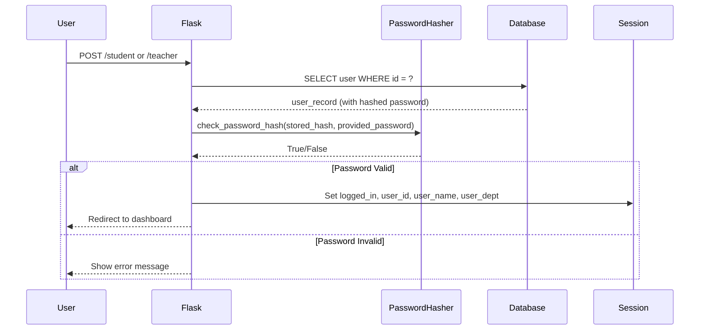
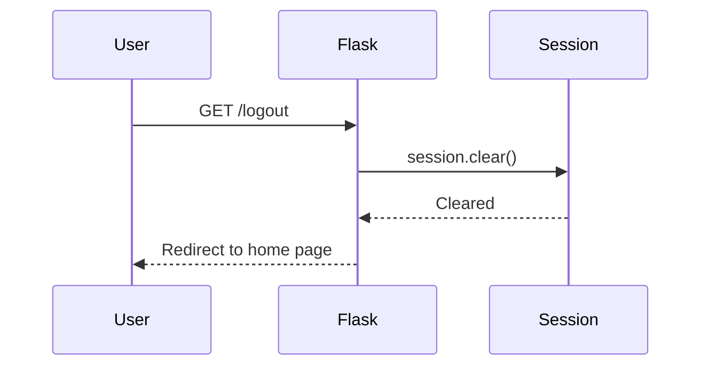

# Design Document: Security Improvements

## Overview

This design document outlines the implementation approach for critical security improvements to the Achievement Management System (AMS). The improvements address four major security vulnerabilities: plain-text password storage, unstable session keys, missing logout functionality, and improper database connection management.

The design follows a minimally invasive approach, modifying only the necessary components to implement security features while maintaining backward compatibility with existing functionality. All changes are localized to the authentication flow, session management, and database access patterns.

### Key Design Principles

1. **Security First**: Implement industry-standard security practices (password hashing, stable secrets)
2. **Minimal Disruption**: Preserve existing routes, templates, and user experience
3. **Resource Safety**: Ensure all database connections are properly managed
4. **Clear Separation**: Keep security logic separate from business logic where possible

## Architecture

### Current Architecture

The AMS is a monolithic Flask application with the following structure:

```
app.py (main application file)
├── Configuration (secret key, DB path, upload folder)
├── Database initialization (init_db, migrations)
├── Authentication routes (/student, /teacher, /student-new, /teacher-new)
├── Dashboard routes (/student-dashboard, /teacher-dashboard)
├── Achievement routes (/submit_achievements, /all-achievements)
└── Utility functions (allowed_file, etc.)
```

**Current Security Issues:**
- Passwords stored as plain text in student and teacher tables
- Secret key regenerated on every application restart
- No logout mechanism
- Database connections opened without consistent cleanup

### Modified Architecture

The security improvements will modify the existing architecture as follows:

```
app.py (enhanced)
├── Configuration
│   ├── Secret key from environment (NEW)
│   └── Existing configuration (DB path, upload folder)
├── Security Module (NEW)
│   ├── Password hashing wrapper
│   └── Password verification wrapper
├── Database Access Layer (MODIFIED)
│   └── Context manager usage for all connections
├── Authentication Routes (MODIFIED)
│   ├── /student (password verification)
│   ├── /teacher (password verification)
│   ├── /student-new (password hashing)
│   ├── /teacher-new (password hashing)
│   └── /logout (NEW)
├── Dashboard Routes (MODIFIED)
│   ├── /student-dashboard (logout link)
│   └── /teacher-dashboard (logout link)
└── Achievement Routes (MODIFIED)
    └── Context manager for DB connections
```

### Security Flow Diagrams

#### Registration Flow (Modified)



#### Login Flow (Modified)



#### Logout Flow (New)



## Components and Interfaces

### 1. Password Security Module

**Purpose**: Provide a consistent interface for password hashing and verification using werkzeug.security.

**Functions**:

```python
def hash_password(plain_password: str) -> str:
    """
    Hash a plain-text password using werkzeug's generate_password_hash.
    
    Args:
        plain_password: The plain-text password to hash
        
    Returns:
        The hashed password string
        
    Raises:
        ValueError: If password is empty or None
    """
    
def verify_password(stored_hash: str, provided_password: str) -> bool:
    """
    Verify a provided password against a stored hash.
    
    Args:
        stored_hash: The stored password hash from database
        provided_password: The plain-text password provided by user
        
    Returns:
        True if password matches, False otherwise
    """
```

**Implementation Notes**:
- Use `werkzeug.security.generate_password_hash()` with default parameters (pbkdf2:sha256)
- Use `werkzeug.security.check_password_hash()` for verification
- Handle edge cases (None, empty strings) gracefully
- These functions will be called from registration and login routes

### 2. Secret Key Configuration

**Purpose**: Load a stable secret key from environment variables for production use.

**Configuration Logic**:

```python
# Load secret key from environment, fallback to generated key for development
SECRET_KEY = os.environ.get('SECRET_KEY')
if SECRET_KEY:
    app.secret_key = SECRET_KEY
else:
    # Development fallback
    app.secret_key = secrets.token_hex(32)
    app.logger.warning("Using generated secret key. Set SECRET_KEY environment variable for production.")
```

**Environment Variable**:
- Name: `SECRET_KEY`
- Format: Hex string (minimum 32 bytes / 64 hex characters)
- Generation: `python -c "import secrets; print(secrets.token_hex(32))"`

### 3. Database Connection Context Manager

**Purpose**: Ensure all database connections are properly closed, even when exceptions occur.

**Pattern**:

```python
# Current pattern (problematic):
connection = sqlite3.connect(DB_PATH)
cursor = connection.cursor()
# ... operations ...
connection.close()  # May not be reached if exception occurs

# New pattern (safe):
with sqlite3.connect(DB_PATH) as connection:
    cursor = connection.cursor()
    # ... operations ...
    # Connection automatically closed when exiting block
```

**Implementation Strategy**:
- Replace all `sqlite3.connect()` calls with context manager usage
- Remove explicit `connection.close()` calls (handled by context manager)
- Ensure no nested or duplicate connection creation within same handler
- Apply to all routes that access the database

**Routes to Modify**:
1. `/student` (login)
2. `/teacher` (login)
3. `/student-new` (registration)
4. `/teacher-new` (registration)
5. `/submit_achievements`
6. `/teacher-dashboard`
7. `/all-achievements`

### 4. Logout Route

**Purpose**: Provide users with a way to securely end their session.

**Route Definition**:

```python
@app.route("/logout")
def logout():
    """
    Clear user session and redirect to home page.
    
    Returns:
        Redirect response to home page
    """
```

**Implementation**:
- Call `session.clear()` to remove all session data
- Redirect to home page using `redirect(url_for('home'))`
- No authentication check required (safe to call when not logged in)
- Add error handling for unexpected exceptions

**Template Integration**:
- Add logout link to `student_dashboard.html`
- Add logout link to `teacher_dashboard.html`
- Link format: `<a href="{{ url_for('logout') }}">Logout</a>`

### 5. Session Management

**Current Session Data**:
```python
session['logged_in'] = True
session['student_id'] = student_data[1]  # or teacher_id
session['student_name'] = student_data[0]  # or teacher_name
session['student_dept'] = student_data[6]  # or teacher_dept
```

**No Changes Required**: The existing session structure is adequate and will be preserved.

**Session Validation**:
- Existing pattern: `if not session.get('logged_in'): return redirect(url_for('student'))`
- This pattern remains unchanged and works correctly with logout functionality

## Data Models

### Student Table (Modified)

```sql
CREATE TABLE student (
    student_name TEXT NOT NULL,
    student_id TEXT PRIMARY KEY,
    email TEXT UNIQUE NOT NULL,
    phone_number TEXT,
    password TEXT NOT NULL,  -- NOW STORES HASHED PASSWORD
    student_gender TEXT,
    student_dept TEXT
)
```

**Changes**:
- `password` column now stores hashed passwords instead of plain text
- Column type remains TEXT (hashed passwords are strings)
- No schema migration required (column already exists)

**Hash Format**:
- Example: `pbkdf2:sha256:260000$salt$hash`
- Length: ~100-150 characters
- TEXT column can accommodate this length

### Teacher Table (Modified)

```sql
CREATE TABLE teacher (
    teacher_name TEXT NOT NULL,
    teacher_id TEXT PRIMARY KEY,
    email TEXT UNIQUE NOT NULL,
    phone_number TEXT,
    password TEXT NOT NULL,  -- NOW STORES HASHED PASSWORD
    teacher_gender TEXT,
    teacher_dept TEXT
)
```

**Changes**:
- `password` column now stores hashed passwords instead of plain text
- Column type remains TEXT
- No schema migration required

### Achievements Table (Unchanged)

No changes required to the achievements table. Database connection management improvements apply to routes that query this table, but the schema remains the same.

### Migration Strategy

**Challenge**: Existing users have plain-text passwords in the database.

**Options**:

1. **Force Password Reset** (Recommended for Production):
   - Clear all existing passwords
   - Require all users to reset passwords on next login
   - Most secure option

2. **Gradual Migration** (Development/Testing):
   - Detect plain-text vs hashed passwords during login
   - If plain-text detected, hash it and update the record
   - Allows existing accounts to continue working

3. **Fresh Start** (Acceptable for Development):
   - Drop and recreate user tables
   - All users must re-register
   - Simplest approach if no production data exists

**Recommended Approach for This Implementation**:
- Use Option 3 (Fresh Start) since this appears to be a development/educational project
- Document the migration strategy in implementation notes
- For production deployment, implement Option 1 with a password reset flow

## Correctness Properties

*A property is a characteristic or behavior that should hold true across all valid executions of a system—essentially, a formal statement about what the system should do. Properties serve as the bridge between human-readable specifications and machine-verifiable correctness guarantees.*


### Property 1: Password Hashing on Registration

*For any* user registration (student or teacher) with a valid password, the password stored in the database should be hashed and should not equal the plain-text input password.

**Validates: Requirements 1.1, 1.2, 1.8**

### Property 2: Login Authentication with Hashed Passwords

*For any* user account (student or teacher) created with a hashed password, logging in with the correct plain-text password should result in successful authentication and session creation.

**Validates: Requirements 1.3, 1.4**

### Property 3: Logout Clears All Session Data

*For any* authenticated user session, accessing the logout route should result in all session data being cleared (session should be empty after logout).

**Validates: Requirements 3.2**

### Property 4: Logout Redirects to Home

*For any* logout request (authenticated or not), the response should be a redirect to the home page.

**Validates: Requirements 3.3**

### Property 5: Dashboard Access Control

*For any* dashboard route (student or teacher), when accessed without an authenticated session, the response should be a redirect to the appropriate login page.

**Validates: Requirements 3.6**

### Property 6: Database Connection Cleanup

*For any* database operation (successful or failed), the database connection should be properly closed after the operation completes or when an exception occurs.

**Validates: Requirements 4.2, 4.4**

### Property 7: Consistent Invalid Credentials Message

*For any* invalid login attempt (wrong password, non-existent user, etc.), the error message displayed should be the generic "Invalid credentials" message without revealing whether the user exists.

**Validates: Requirements 6.2**

### Property 8: No Internal Error Exposure

*For any* error condition in the application, the response to the end user should not contain internal error details such as stack traces, SQL error messages, or file paths.

**Validates: Requirements 6.4**

## Error Handling

### Password Hashing Errors

**Scenario**: Password hashing function fails during registration

**Handling**:
1. Catch exceptions from `generate_password_hash()`
2. Log the error with full details (server-side only)
3. Display user-friendly message: "Unable to create account. Please try again."
4. Do not create the account (no database insert)
5. Return HTTP 500 or render registration form with error

**Implementation**:
```python
try:
    hashed_password = hash_password(password)
except Exception as e:
    app.logger.error(f"Password hashing failed: {e}")
    return render_template("student_new_2.html", 
                         error="Unable to create account. Please try again.")
```

### Database Connection Errors

**Scenario**: Database connection fails or query execution fails

**Handling**:
1. Context manager ensures connection cleanup
2. Catch `sqlite3.Error` exceptions
3. Log the error with full details (server-side only)
4. Display user-friendly message: "A database error occurred. Please try again."
5. Return appropriate HTTP status or render form with error

**Implementation**:
```python
try:
    with sqlite3.connect(DB_PATH) as connection:
        cursor = connection.cursor()
        # ... database operations ...
except sqlite3.Error as e:
    app.logger.error(f"Database error in {route_name}: {e}")
    return render_template(template_name, 
                         error="A database error occurred. Please try again.")
```

### Authentication Errors

**Scenario**: Invalid credentials during login

**Handling**:
1. Do not distinguish between "user not found" and "wrong password"
2. Always return the same generic message
3. Log failed login attempts (for security monitoring)
4. Display: "Invalid credentials. Please try again."

**Security Rationale**: Prevents username enumeration attacks

**Implementation**:
```python
# Query for user
cursor.execute("SELECT * FROM student WHERE student_id = ?", (student_id,))
student_data = cursor.fetchone()

if not student_data or not verify_password(student_data[4], password):
    app.logger.warning(f"Failed login attempt for student_id: {student_id}")
    return render_template("student.html", 
                         error="Invalid credentials. Please try again.")
```

### Logout Errors

**Scenario**: Unexpected error during logout (rare but possible)

**Handling**:
1. Attempt to clear session
2. If error occurs, log it but continue
3. Always redirect to home page (fail-safe behavior)
4. User should never see an error during logout

**Implementation**:
```python
@app.route("/logout")
def logout():
    try:
        session.clear()
    except Exception as e:
        app.logger.error(f"Error during logout: {e}")
    return redirect(url_for('home'))
```

### Session Validation Errors

**Scenario**: User attempts to access protected route without valid session

**Handling**:
1. Check for `session.get('logged_in')`
2. If not authenticated, redirect to login
3. No error message needed (normal flow)

**Implementation** (existing pattern, unchanged):
```python
if not session.get('logged_in'):
    return redirect(url_for('student'))
```

## Testing Strategy

### Dual Testing Approach

This feature requires both unit tests and property-based tests to ensure comprehensive coverage:

- **Unit tests**: Verify specific examples, edge cases, and error conditions
- **Property tests**: Verify universal properties across all inputs

Both testing approaches are complementary and necessary. Unit tests catch concrete bugs in specific scenarios, while property tests verify general correctness across a wide range of inputs.

### Property-Based Testing

**Library**: Use `hypothesis` for Python property-based testing

**Configuration**: Each property test should run a minimum of 100 iterations to ensure adequate coverage through randomization.

**Test Tagging**: Each property test must include a comment referencing the design document property:

```python
# Feature: security-improvements, Property 1: Password Hashing on Registration
@given(...)
def test_password_hashing_on_registration(...):
    ...
```

### Unit Testing Strategy

**Focus Areas**:
1. Specific examples of successful registration and login
2. Edge cases (empty passwords, special characters, very long passwords)
3. Error conditions (database failures, hashing failures)
4. Integration points (session management, redirects)

**Avoid**: Writing too many unit tests for scenarios that property tests already cover. Focus unit tests on:
- Concrete examples that demonstrate correct behavior
- Edge cases that are hard to generate randomly
- Error handling paths
- UI integration (logout links, error messages)

### Test Coverage by Requirement

#### Requirement 1: Password Hashing

**Property Tests**:
- Property 1: Password Hashing on Registration (100+ iterations)
  - Generate random student/teacher registration data
  - Verify stored password is hashed (not equal to input)
  
- Property 2: Login Authentication with Hashed Passwords (100+ iterations)
  - Generate random user accounts with hashed passwords
  - Verify login succeeds with correct password

**Unit Tests**:
- Test registration with specific password examples
- Test login with correct password
- Test login with incorrect password
- Test edge case: empty password
- Test edge case: very long password (>1000 chars)
- Test error: password hashing failure (mocked)

#### Requirement 2: Stable Secret Key Management

**Unit Tests** (property tests not applicable):
- Test secret key loaded from environment variable
- Test fallback key generated when env var not set
- Test secret key remains constant across restarts (with env var)
- Test session invalidation when key changes
- Test warning logged when using fallback key
- Test secret key length validation

#### Requirement 3: Logout Functionality

**Property Tests**:
- Property 3: Logout Clears All Session Data (100+ iterations)
  - Generate random session data
  - Verify session is empty after logout
  
- Property 4: Logout Redirects to Home (100+ iterations)
  - Test logout with various session states
  - Verify redirect to home page
  
- Property 5: Dashboard Access Control (100+ iterations)
  - Test dashboard access without authentication
  - Verify redirect to login

**Unit Tests**:
- Test logout route exists (GET /logout returns 200 or 302)
- Test logout link present in student dashboard
- Test logout link present in teacher dashboard
- Test logout when not logged in (graceful handling)
- Test error during logout (exception handling)

#### Requirement 4: Database Connection Management

**Property Tests**:
- Property 6: Database Connection Cleanup (100+ iterations)
  - Test various database operations
  - Verify connections are closed (check connection count)
  - Test with simulated errors
  - Verify connections still closed after errors

**Unit Tests**:
- Test specific route with successful database operation
- Test specific route with database error
- Test connection cleanup with exception
- Verify no multiple connections in same handler

#### Requirement 5: Backward Compatibility

**Unit Tests** (property tests not applicable):
- Test all existing routes still exist and respond
- Test all templates still render without errors
- Test session data structure unchanged
- Test database schema unchanged (table structure)

#### Requirement 6: Error Handling

**Property Tests**:
- Property 7: Consistent Invalid Credentials Message (100+ iterations)
  - Generate various invalid login attempts
  - Verify all return same error message
  
- Property 8: No Internal Error Exposure (100+ iterations)
  - Generate various error conditions
  - Verify responses don't contain stack traces, SQL errors, etc.

**Unit Tests**:
- Test password hashing failure error message
- Test database connection error message
- Test invalid credentials error message
- Test logout error handling
- Test error response format (no sensitive data)

### Testing Tools and Setup

**Required Libraries**:
```
pytest>=7.0.0
hypothesis>=6.0.0
flask-testing>=0.8.0
```

**Test Structure**:
```
tests/
├── test_password_security.py      # Property 1, 2
├── test_secret_key.py             # Requirement 2 unit tests
├── test_logout.py                 # Property 3, 4, 5
├── test_database_connections.py   # Property 6
├── test_error_handling.py         # Property 7, 8
└── test_backward_compatibility.py # Requirement 5 unit tests
```

### Example Property Test

```python
from hypothesis import given, strategies as st
import pytest

# Feature: security-improvements, Property 1: Password Hashing on Registration
@given(
    student_name=st.text(min_size=1, max_size=100),
    student_id=st.text(min_size=1, max_size=50),
    email=st.emails(),
    password=st.text(min_size=1, max_size=200)
)
def test_password_hashing_on_registration(client, student_name, student_id, email, password):
    """
    For any user registration with a valid password, 
    the stored password should be hashed and not equal to the input.
    """
    # Register student
    response = client.post('/student-new', data={
        'student_name': student_name,
        'student_id': student_id,
        'email': email,
        'password': password,
        'student_gender': 'Male',
        'student_dept': 'CS'
    })
    
    # Query database for stored password
    with sqlite3.connect(DB_PATH) as conn:
        cursor = conn.cursor()
        cursor.execute("SELECT password FROM student WHERE student_id = ?", (student_id,))
        result = cursor.fetchone()
        
    if result:
        stored_password = result[0]
        # Verify password is hashed (not equal to plain text)
        assert stored_password != password
        # Verify it's a valid hash format
        assert stored_password.startswith('pbkdf2:sha256:')
```

### Test Execution

**Run all tests**:
```bash
pytest tests/ -v
```

**Run property tests only**:
```bash
pytest tests/ -v -m property
```

**Run with coverage**:
```bash
pytest tests/ --cov=app --cov-report=html
```

### Success Criteria

- All property tests pass with 100+ iterations each
- All unit tests pass
- Code coverage > 80% for modified code
- No security vulnerabilities detected
- All existing functionality preserved
